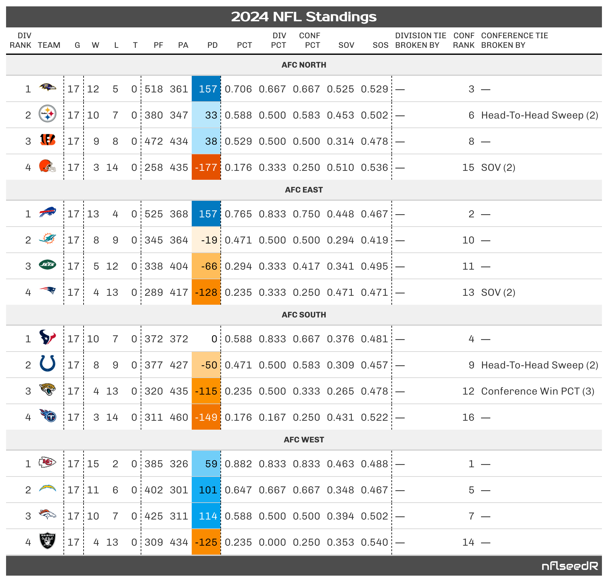

# nflendzoneData

This repository contains automated data releases for `nflendzone`,
published via GitHub Actions and Releases. All data here is derived from
and powered by the [nflverse project](https://nflverse.com/), which
provides open, community-driven, regularly maintained NFL data resources
for R and Python. You can download and analyze data using R, Python, or
other modern tools.

------------------------------------------------------------------------

## 📊️ About the Data

| Tag | Description |
|----|----|
| `nfl_stats_week_team_regpost` | Weekly team stats (regular and postseason) |
| `nfl_stats_week_player_regpost` | Weekly player stats (regular and postseason) |
| `nfl_stats_season_team_regpost` | Season-level team stats (regular and postseason) |
| `nfl_stats_season_player_regpost` | Season-level player stats (regular and postseason) |
| `season_standings` | Finalized standings for each NFL season |
| `weekly_standings` | Standings updated weekly |
| `elo` | Season-by-season ELO ratings |
| `srs` | Season-by-season Simple Rating System ratings |
| `epa` | Season expected points added summaries |
| `scores` | Team-level scores across all seasons |
| `series` | Team-level series conversion rate stats |
| `turnover` | Turnovers by team/season |
| `redzone` | Red-zone efficiency metrics |
| `team_features` | Team-level feature set for modeling |
| `game_features` | Game-level feature set for modeling |
| `team_model` | Model-ready team-level dataset |
| `game_model` | Model-ready game-level dataset |

------------------------------------------------------------------------

## 🤖 Automation Status

The table below shows which data sets are available and when they were
last updated:

| Dataset | Status | Last Updated |
|:---|:---|:---|
| nfl_stats_week_team_regpost | [](https://github.com/TylerPollard410/nflendzoneData/releases/tag/nfl_stats_week_team_regpost) | [](https://github.com/TylerPollard410/nflendzoneData/releases/tag/nfl_stats_week_team_regpost) |
| nfl_stats_week_player_regpost | [](https://github.com/TylerPollard410/nflendzoneData/releases/tag/nfl_stats_week_player_regpost) | [](https://github.com/TylerPollard410/nflendzoneData/releases/tag/nfl_stats_week_player_regpost) |
| nfl_stats_season_team_regpost | [](https://github.com/TylerPollard410/nflendzoneData/releases/tag/nfl_stats_season_team_regpost) | [](https://github.com/TylerPollard410/nflendzoneData/releases/tag/nfl_stats_season_team_regpost) |
| nfl_stats_season_player_regpost | [](https://github.com/TylerPollard410/nflendzoneData/releases/tag/nfl_stats_season_player_regpost) | [](https://github.com/TylerPollard410/nflendzoneData/releases/tag/nfl_stats_season_player_regpost) |
| season_standings | [](https://github.com/TylerPollard410/nflendzoneData/releases/tag/season_standings) | [](https://github.com/TylerPollard410/nflendzoneData/releases/tag/season_standings) |
| weekly_standings | [](https://github.com/TylerPollard410/nflendzoneData/releases/tag/weekly_standings) | [](https://github.com/TylerPollard410/nflendzoneData/releases/tag/weekly_standings) |
| elo | [](https://github.com/TylerPollard410/nflendzoneData/releases/tag/elo) | [](https://github.com/TylerPollard410/nflendzoneData/releases/tag/elo) |
| srs | [](https://github.com/TylerPollard410/nflendzoneData/releases/tag/srs) | [](https://github.com/TylerPollard410/nflendzoneData/releases/tag/srs) |
| epa | [](https://github.com/TylerPollard410/nflendzoneData/releases/tag/epa) | [](https://github.com/TylerPollard410/nflendzoneData/releases/tag/epa) |
| scores | [](https://github.com/TylerPollard410/nflendzoneData/releases/tag/scores) | [](https://github.com/TylerPollard410/nflendzoneData/releases/tag/scores) |
| series | [](https://github.com/TylerPollard410/nflendzoneData/releases/tag/series) | [](https://github.com/TylerPollard410/nflendzoneData/releases/tag/series) |
| turnover | [](https://github.com/TylerPollard410/nflendzoneData/releases/tag/turnover) | [](https://github.com/TylerPollard410/nflendzoneData/releases/tag/turnover) |
| redzone | [](https://github.com/TylerPollard410/nflendzoneData/releases/tag/redzone) | [](https://github.com/TylerPollard410/nflendzoneData/releases/tag/redzone) |
| team_features | [](https://github.com/TylerPollard410/nflendzoneData/releases/tag/team_features) | [](https://github.com/TylerPollard410/nflendzoneData/releases/tag/team_features) |
| game_features | [](https://github.com/TylerPollard410/nflendzoneData/releases/tag/game_features) | [](https://github.com/TylerPollard410/nflendzoneData/releases/tag/game_features) |
| team_model | [](https://github.com/TylerPollard410/nflendzoneData/releases/tag/team_model) | [](https://github.com/TylerPollard410/nflendzoneData/releases/tag/team_model) |
| game_model | [](https://github.com/TylerPollard410/nflendzoneData/releases/tag/game_model) | [](https://github.com/TylerPollard410/nflendzoneData/releases/tag/game_model) |

Automation status for nflendzone data releases.

## 📆 Update Schedule

Data updates are triggered daily at 4 AM Eastern during the NFL season
(September–February) via GitHub Actions.

------------------------------------------------------------------------

## 🛠️ Usage

- Download manually from the [Releases
  page](https://github.com/TylerPollard410/nflendzoneData/releases).

- Or programmatically in **R** (choose your format):

``` r
# RDS format (no local file needed)
url_rds <- "https://github.com/TylerPollard410/nflendzoneData/releases/download/season_standings/season_standings.rds"
data_rds <- readRDS(url(url_rds))

# Parquet format
library(arrow) 
url_par <- "https://github.com/TylerPollard410/nflendzoneData/releases/download/season_standings/season_standings.parquet"
data_par <- read_parquet(url_par)

# CSV format
library(readr)
url_csv <- "https://github.com/TylerPollard410/nflendzoneData/releases/download/season_standings/season_standings.csv"
data_csv <- read_csv(url_csv)
```

- Or programmatically in **Python**:

``` python
# RDS (requires pyreadr)
import pyreadr, requests
url = "https://github.com/TylerPollard410/nflendzoneData/releases/download/season_standings/season_standings.rds"
r = requests.get(url)
with open('season_standings_latest.rds', 'wb') as f:
    f.write(r.content)
result = pyreadr.read_r('season_standings_latest.rds')
df = result[None]

# Parquet
import pandas as pd
df = pd.read_parquet("https://github.com/TylerPollard410/nflendzoneData/releases/download/season_standings/season_standings.parquet")

# CSV
df = pd.read_csv("https://github.com/TylerPollard410/nflendzoneData/releases/download/season_standings/season_standings.csv")
```

- **Download and combine the latest 3 seasons (RDS, in-memory):**

``` r
library(purrr)
years <- 2022:2024
urls_multi_rds <- sprintf(
  "https://github.com/TylerPollard410/nflendzoneData/releases/download/season_standings/season_standings_%s.rds",
  years
)
data_multi <- purrr::map_dfr(urls_multi_rds, \(x) readRDS(url(x)))
```

- **Load multiple seasons *lazily* with
  [duckdbfs](https://github.com/ijlyttle/duckdbfs) (recommended for
  Shiny/cloud):**

``` r
library(duckdbfs)
library(dplyr)

# List of remote Parquet URLs for the latest 3 seasons
years <- 2022:2024
urls_multi_par <- sprintf(
  "https://github.com/TylerPollard410/nflendzoneData/releases/download/season_standings/season_standings_%s.parquet",
  years
)

ds <- duckdbfs::open_dataset(urls_multi_par, format = "parquet")
ds  # This is a lazy Arrow/duckdb dataset
#> # Source:   table<fntaaooxcqcamwj> [?? x 26]
#> # Database: DuckDB v1.3.2 [root@Darwin 22.6.0:R 4.5.1/:memory:]
#>    season team  conf  division  games  wins true_wins losses  ties    pf    pa
#>     <int> <chr> <chr> <chr>     <int> <dbl>     <int>  <int> <int> <int> <int>
#>  1   2022 ARI   NFC   NFC West     17     4         4     13     0   340   449
#>  2   2022 ATL   NFC   NFC South    17     7         7     10     0   365   386
#>  3   2022 BAL   AFC   AFC North    17    10        10      7     0   350   315
#>  4   2022 BUF   AFC   AFC East     16    13        13      3     0   455   286
#>  5   2022 CAR   NFC   NFC South    17     7         7     10     0   347   374
#>  6   2022 CHI   NFC   NFC North    17     3         3     14     0   326   463
#>  7   2022 CIN   AFC   AFC North    16    12        12      4     0   418   322
#>  8   2022 CLE   AFC   AFC North    17     7         7     10     0   361   381
#>  9   2022 DAL   NFC   NFC East     17    12        12      5     0   467   342
#> 10   2022 DEN   AFC   AFC West     17     5         5     12     0   287   359
#> # ℹ more rows
#> # ℹ 15 more variables: pd <int>, win_pct <dbl>, div_pct <dbl>, conf_pct <dbl>,
#> #   MOV <dbl>, SOS <dbl>, SRS <dbl>, OSRS <dbl>, DSRS <dbl>, sov <dbl>,
#> #   sos_1 <dbl>, div_rank <int>, div_tie_broken_by <chr>, conf_rank <int>,
#> #   conf_tie_broken_by <chr>

# Example: Query only the rows you need (no full download!)
df_recent <- ds |> 
  dplyr::select(-c(MOV, SOS, SRS, OSRS, DSRS)) |>
  dplyr::rename(sos = sos_1) |>
  dplyr::filter(season >= 2024 & conf == "AFC") |> 
  dplyr::collect()
```

------------------------------------------------------------------------

> **Tip:** The `duckdbfs` with `dplyr` approach allows truly lazy
> queries and is how our Shiny app on shinyapps.io works—keeping RAM
> usage low and only downloading filtered data as needed.

## 📈 Visualization

The [nflverse](https://nflverse.com/) R packages, which power the data
in this repo, also provide convenient built-in functions for visualizing
and exploring NFL data. For example, you can use
`nflseedR::nfl_standings_prettify()` to generate high-quality standings
tables from your queried data.

``` r
# Generate standings table using nflseedR built-in function
library(nflseedR)
library(gt)
df_recent |> 
  nflseedR::nfl_standings_prettify()
```



------------------------------------------------------------------------

## ⚖️ License

All data is released under [CC‑BY‑4.0](LICENSE.md). If you use this
data, please cite the repository and include a link to the corresponding
release tag.

------------------------------------------------------------------------

Let me know if you want additional code snippets, a FAQ, or to highlight
more power-user tricks (e.g., batch downloading, query examples, etc)!
